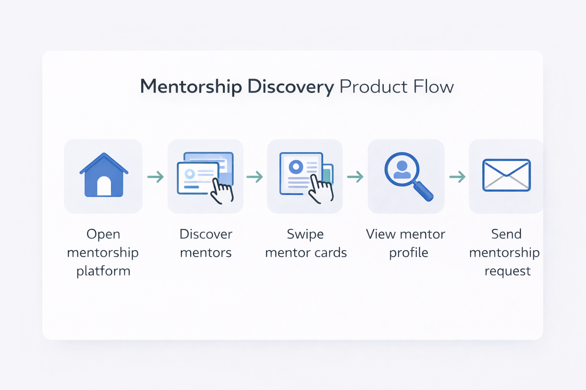
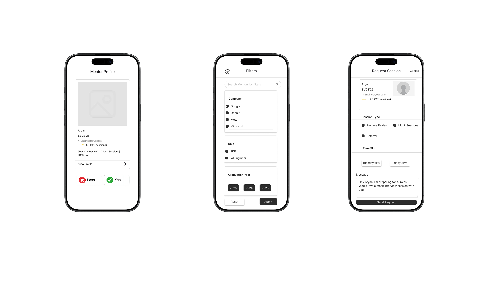

# Mentorship Matchmaking — Product Case Study

## Overview

Students preparing for placements often struggle to connect with the right alumni mentors.  
Most outreach happens through scattered LinkedIn messages, WhatsApp groups, or informal referrals, making it difficult to identify mentors who are both relevant and willing to help.

This case study explores a product concept designed to simplify mentorship discovery and reduce friction in connecting students with alumni.

The project walks through the full product thinking process — from identifying the problem to designing a prototype.

---

## Problem

Students face several challenges when trying to find mentors during placements:

- Difficulty identifying relevant alumni mentors
- Uncertainty about whether mentors are willing to help
- High friction in initiating conversations
- Lack of structured discovery tools

As a result, many students either struggle to reach out or rely on random outreach methods.

---

## Key Insight

Mentorship discovery behaves similarly to matchmaking.

Students need a **fast way to evaluate whether a mentor is relevant** before deciding to reach out.

Traditional directories or alumni lists require too much effort and create decision fatigue.

A **lightweight discovery interface** can significantly reduce friction and encourage outreach.

---

## Proposed Solution

A mentorship discovery platform that allows students to:

- Quickly browse alumni mentors
- Filter mentors by company, role, or graduation year
- Evaluate mentors through structured profiles
- Send mentorship requests through a simple interface

The goal is to create a **low-friction discovery and connection experience**.

---

## Product Flow

The following diagram illustrates the overall interaction flow.

1. Student opens the mentorship platform  
2. Student browses mentor profiles  
3. Student swipes through mentor cards  
4. Student views mentor details  
5. Student sends a mentorship request  

---

## Key Screens

The prototype explores three core interaction surfaces.

### Mentor Discovery
Students browse mentor cards and quickly decide whether the mentor is relevant.

### Filters
Students narrow down mentors based on company, role, and graduation year.

### Request Session
Students send structured mentorship requests to mentors.

---

## Key Product Decisions

**Swipe-based discovery**

- Reduces friction compared to browsing long alumni directories
- Allows quick evaluation of mentors

**Structured mentor profiles**

- Ensures students have the context needed before reaching out
- Improves match quality

**Filtering options**

- Allows students to target mentors based on goals such as company or role

---

## Success Metrics

If implemented, the platform could measure success through:

- Mentor connection rate
- Session booking rate
- Mentor response rate
- Student satisfaction with mentorship sessions

---

## Case Study Breakdown

Detailed exploration of each stage of the product thinking process:

- [Problem Discovery](problem-discovery.md)
- [Problem Validation](problem-validation.md)
- [Insights](insights.md)
- [Feature Prioritization](prioritization.md)
- [Prototype](prototype.md)

---

## Next Steps

If validated, the next stage would involve:

- User testing with students preparing for placements
- Evaluating mentor response behavior
- Measuring engagement with the discovery interface
- Iterating on the matching and recommendation system

---

## Author

Jyotsna Raagasri  
Product & Data 

