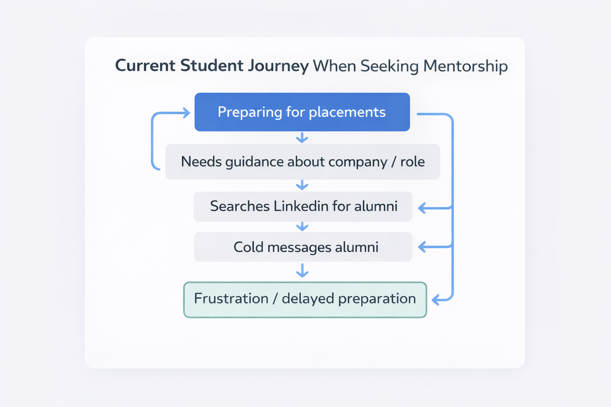
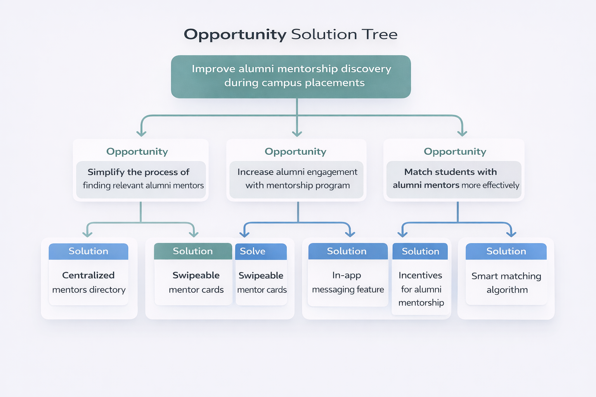

# Problem Discovery

## Context

During campus placements, many students actively try to connect with alumni for guidance on interview preparation, company culture, and role expectations.

However, discovering relevant alumni mentors is often difficult and unstructured.

## Observation

Students typically rely on:

- Cold messaging alumni on LinkedIn
- Asking seniors for introductions
- Searching through alumni groups

These approaches often lead to low response rates and inefficient discovery.

## Problem Statement

Students preparing for placements struggle to discover and connect with relevant alumni mentors who can provide timely guidance.

## Current Student Journey

The current process of discovering mentors involves several fragmented steps and often results in frustration due to low response rates.

## Opportunity Solution Tree

The opportunity solution tree maps potential ways to address the problem of mentorship discovery.

## Why This Matters

Mentorship during placements can significantly impact preparation quality and confidence.

When access to alumni insights is difficult, students rely on fragmented or second-hand information.

## Initial Hypothesis

If students could easily discover and connect with alumni mentors based on company, role, or experience, mentorship access during placements would improve.
