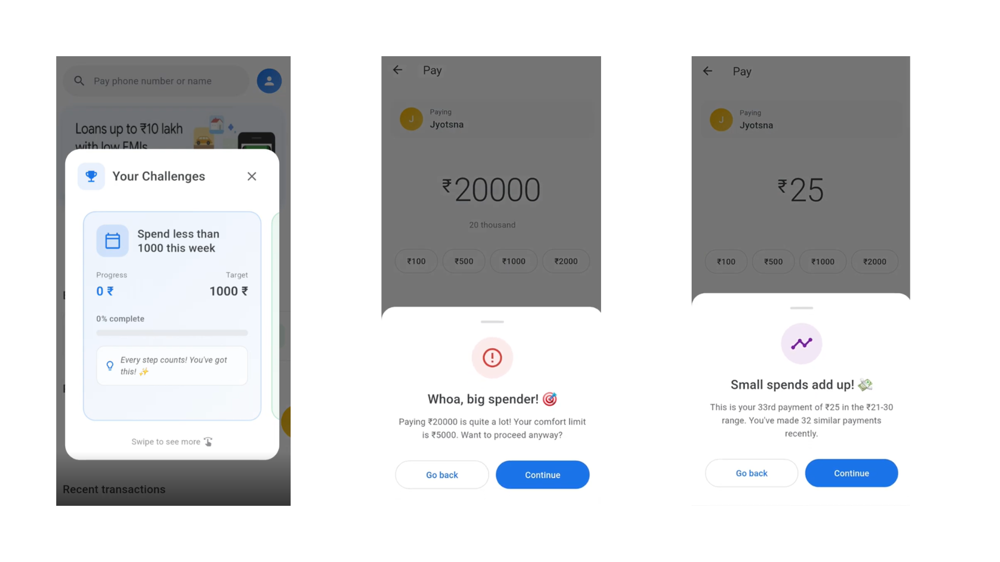
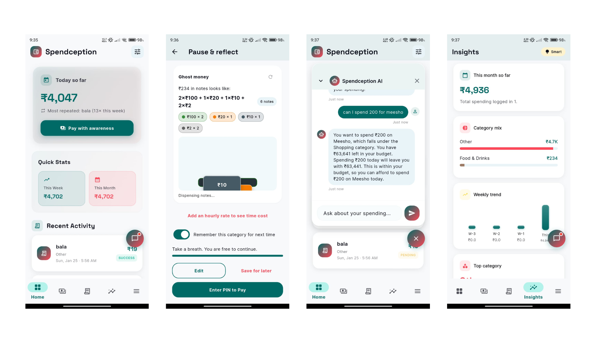
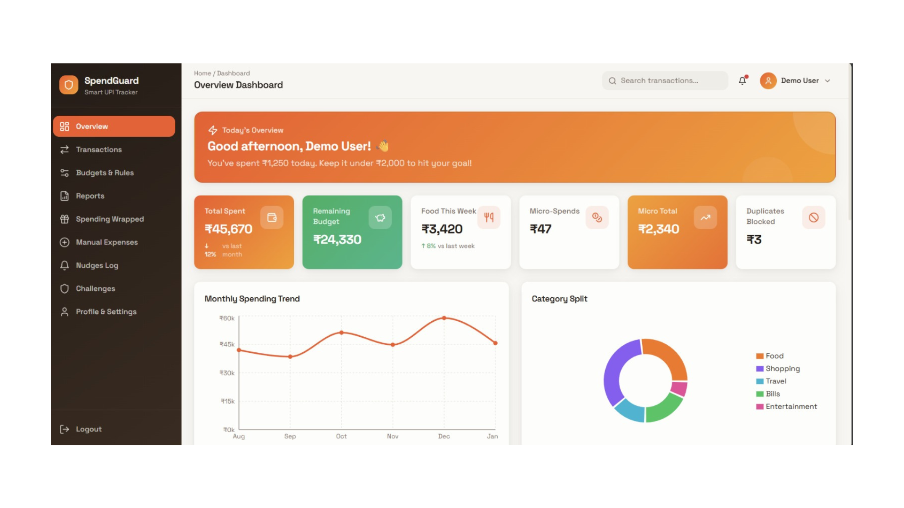

# Prototype

## Objective

Explore a simple interface that introduces spending awareness without interrupting the payment flow.

The prototype focuses on delivering behavioral nudges and financial insights during digital payments.

---

## Product Flow

1. User initiates a payment
2. The system analyzes the transaction context
3. A spending awareness prompt may appear
4. The user decides whether to proceed
5. The transaction completes
6. Spending insights update in the dashboard

---

## Key Screens

The following prototype screens demonstrate how the system introduces spending awareness during digital payments.

---

### Spending Awareness Nudges

When unusual spending behavior is detected, the system introduces contextual nudges.

Examples include:

- Alerts for large transactions
- Notifications when small payments accumulate
- Gentle prompts encouraging users to reconsider spending

The goal is to **guide users toward mindful spending without restricting transactions**.

---

### Mobile Application Experience

The mobile interface provides users with quick visibility into their spending behavior.

Key elements include:

- Today's spending summary
- Quick spending statistics
- Recent transaction activity
- AI assistant for financial queries

This screen focuses on **making financial awareness easily accessible during everyday payments**.

---

### Spending Analytics Dashboard

The analytics dashboard provides deeper insights into long-term spending patterns.

It includes:

- Monthly spending trends
- Category-wise expense breakdown
- Micro-spend accumulation
- Remaining budget insights

These insights help users **identify patterns and improve financial habits over time**.

---

## Early Assumptions

- Users are more likely to reflect on spending when prompted before payment
- Micro-spend alerts improve spending awareness
- AI-assisted insights can simplify financial decision-making

---

## Next Steps

Future validation would involve:

- Testing behavioral nudges with real users
- Measuring how often users reconsider payments
- Evaluating engagement with spending insights
